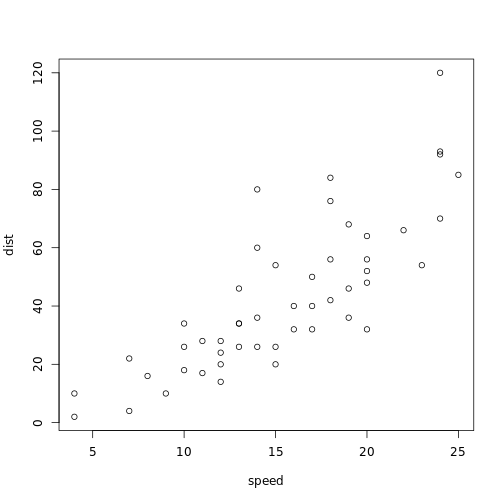

Customer Segementation
========================================================
author: Ferdiansyah
date: 15 September 2019
autosize: true

Business Understanding 
========================================================

On Line Retail adalah perusahaan yang menjual segala macam jenis barang secara online.
Untuk menentukan strategi marketing yang tepat dan pengembangan bisnis perlu dilakukan analisa terhadap data pelanggan. Analisa ini dilakukan dengan tujuan antara lain :

- Mengenali siapa customer yang paling berharga 
- Mempelajari behavior dari pelangan
- Meningkatkan Retensi pelanggan dan revenue perusahaan


Data Understanding
========================================================


```r
library(dplyr)
library(plotly)
library(factoextra)
library(corrplot)

# Data Preparation
data<-read.csv('https://raw.githubusercontent.com/arikunco/machinelearning/master/dataset/online_retail_clean.csv')

 head(data)
```

```
  CustomerID  recency frequency monetary
1      12680 21.46528         2    68.40
2      15311 21.50000        36  1081.75
3      14446 21.51806         3    18.26
4      12518 21.57431         4   124.38
5      14441 21.62014         1    59.40
6      13883 22.19444         3    32.95
```

Slide With Plot
========================================================




# Import Library

library(dplyr)
library(plotly)
library(factoextra)
library(corrplot)

# Data Preparation
data<-read.csv('https://raw.githubusercontent.com/arikunco/machinelearning/master/dataset/online_retail_clean.csv')


print(summary(data))
head(data)

data<-filter(data, monetary >= 0) %>% na.omit(data)
print(summary(data))

### Data sudah terformat rapih dan disap untuk dilakukan langkah selanjutnya


## Data exploratori

# Melakukan korelasi ke setiap variable

df_cor<-cor(df_encode[,2:4])
df_cor

corrplot(df_cor, type = "upper", order = "original", 
         tl.col = "black")

## Hasil dari correlasi tidak menunjukan ada nya korelasi dari masing-masing varible

#melihat bentuk distribusi dari masing2 variable
d <- density(df_encode$recency) # returns the density data recency 
plot(d) # plots the results

d <- density(df_encode$frequency) # returns the density data frequency
plot(d) # plots the results

d <- density(df_encode$monetary) # returns the density data monetary
plot(d) # plots the results

## dari bentuk distribusi terlihat ketiga varible memiliki distribusi yang tidak normal (skew)
## untuk menormalisasi distribusi dilakukan transformasi logaritma
df_encode$recency_l <- log10(df_encode$recency+0.1)
df_encode$frequency_l <- log10(df_encode$frequency)
df_encode$monetary_l <- log10(df_encode$monetary+0.1)

d <- density(df_encode$recency_l) # returns the density data recency 
plot(d) # plots the results

d <- density(df_encode$frequency_l) # returns the density data frequency
plot(d) # plots the results

d <- density(df_encode$monetary_l) # returns the density data monetary
plot(d) # plots the results

plot(df_encode[,c("recency_l","frequency_l","monetary_l")], main = "HC of RFM")

head(df_encode)

df_cor3<-cor(df_encode[,c("recency_l","frequency_l","monetary_l")])
df_cor3

corrplot(df_cor3, type = "upper", order = "original", 
         tl.col = "black")

## Setelah dilakukan normalisasi terlihat terdapat korelasi antara monetary dengan frequency


# RFM Scoring Method

### Metode RFM Scoring adalah metode dengan membagi setiap variable RFM menjadi 4 bagian dan memberikan score pada masing-masing bagian

### Encode dataset breakdown into 4 for each variables 
r <- quantile(data$recency,c(0.25,0.5,0.75))
f <- quantile(data$frequency, c(0.25,0.5,0.75))
m <- quantile(data$monetary, c(0.25,0.5,0.75))

### membagi data frame menjadi empat group berdasarkan nilai quartile nya
df_encode <- data %>% mutate(m_recency=ifelse(recency<as.numeric(r[1]),4,
                                              ifelse(recency<as.numeric(r[2]),3,
                                                     ifelse(recency<as.numeric(r[3]),2,1))),
                             m_frequency=ifelse(frequency<as.numeric(f[1]),1,
                                                ifelse(frequency<as.numeric(f[2]),2,
                                                       ifelse(frequency<as.numeric(f[3]),3,4))),
                             m_monetary=ifelse(monetary<as.numeric(m[1]),1,
                                               ifelse(monetary<as.numeric(m[2]),2,
                                                      ifelse(monetary<as.numeric(m[3]),3,4))))

### Group 1 adalah group yang kurang baik dan group 4 adalah group terbaik
### Untuk recency Quartile 1 adalah group 4 karena semakin kecil nilai rencency maka dianggap semakin baik
### Untuk Frequency dan MOnetary Quartile 1 adalah group 1 karena semakin jarang melakukan pembelian dan semakin kecil nilai pembelian dianggap semakin kurang baik


### preview first 6th rows
head(df_encode)

### menghitung RFM Score 
df_encode$rfmscore<-(df_encode$m_recency*100)+(df_encode$m_frequency*10)+(df_encode$m_monetary)

head(df_encode)
str(df_encode)
## Customer Segment by RFM Score
nrow(filter(df_encode,rfmscore == 444))

print(paste("Best Customer :", nrow(filter(df_encode,rfmscore == 444))))
print(paste("Loyal Customer :", nrow(filter(df_encode,m_recency == 4))))
print(paste("Big Spender Customer :", nrow(filter(df_encode,m_monetary == 4))))
print(paste("Lost Customer :", nrow(filter(df_encode,rfmscore == 144))))
print(paste("Lost Cheap Customer :", nrow(filter(df_encode,rfmscore == 111))))

plot(df_encode[,2:4], col = df_encode$rfmscore,
     main = "Group by RFM Score")

#### 3D plot
p <- plot_ly(df_encode, x = ~recency, y = ~frequency, z = ~monetary, color = ~rfmscore) %>%
  add_markers() %>%
  layout(scene = list(xaxis = list(title = 'Recency'),
                      yaxis = list(title = 'Frequency'),
                      zaxis = list(title = 'Monetary')))

p


# RFM Model menggunakan Kmean

## Dikarenakan hanya terdapat korelasi antara Frequency dan Monetary maka clustring hanya dihitung dengan mempertimbangkan varible frequency dan monetary

#### Mencari jumlah cluster optimal

#### Elbow method
fviz_nbclust(df_encode[,c("frequency_l","monetary_l")], kmeans, method = "wss") +
  geom_vline(xintercept = 2, linetype = 2)+
  labs(subtitle = "Elbow method")


##### Silhouette method

fviz_nbclust(df_encode[,c("frequency_l","monetary_l")], kmeans, method = "silhouette")+
  labs(subtitle = "Silhouette method")

#### Kedua metode menghasilkan jumlah K optimal k=2


#### Membuat model k-mean
km.out <- kmeans(df_encode[,c("recency_l","frequency_l","monetary_l")], center=2, nstart=10)
df_encode$cluster <- km.out$cluster

#### Plot hasil clustering
plot(df_encode[,c("frequency_l","monetary_l")], col = df_encode$cluster,
     main = "K-MEANS of RFM")
head(df_encode)

# Resume

### Dengan metode RFM dapat diketahui Best customer dan loyal Customer yang dapat diberikan promosi "buy one get one" atau promosi "bring a friend" untuk meningkatkan retensi 
### Untuk Lost customer dapat diberikan promosi diskon agar mereka dapat kembali menjadi customer
### Dengan metode K Means customer terbagi menjadi 2 cluster
### Cluster pertama adalah cluster customer dengan monetary dan frequensi rendah
### Cluster kedua adalah cluster customer dengan frequency dan monetary tinggi
### 


